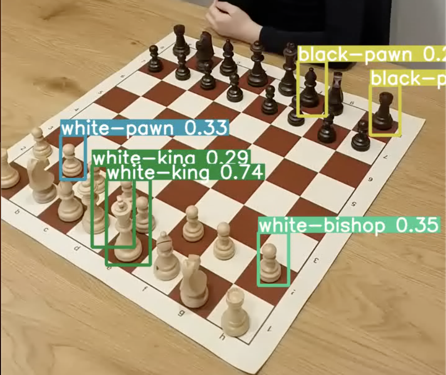

TODO: Yolov9??

# Dataset used

https://public.roboflow.com/object-detection/chess-full/24

# How to configure environment?

Install the dependencies:
!pip install -r requirements.txt

# How to download the weights? (In this project: already downloaded)

!wget https://github.com/ultralytics/yolov5/releases/download/v6.0/yolov5s.pt

# How to train the model?

Train the model on images with image size 416, batch size 8 and epochs 400:
!python train.py --img 416 --batch 8 --epochs 400 --data data/data.yaml --weights yolov5s.pt  --nosave --cache

# How to predict using the model?

Predict on images with image size 640:
!python detect.py --source data/dataset/predict/chess.mp4  --weights runs/train/exp2/weights/last.pt --img 640 --save-txt --save-conf

# Result 1

As expected, the model doesn't perform that well... Maybe try with other angles?

The model performs way better, but still make a lot of mistakes. This needs to be better. Yolov9??

